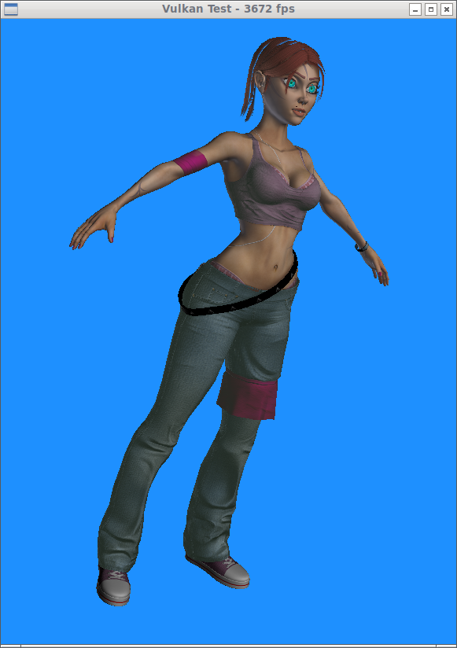

# Vulkan Demos
A WIP collection of simple Vulkan demos which I'm developing.

## Demos
* basic       : the usual hello world (mainly the Alexander Overvoorde tutorial)
* model       : model loading (basic vulkan usage)
* asModel     : model loading with Assimp (multiple descriptor sets, pipeline (on disk) caches, multisampling)

### Data
* [kila](https://cgi.tutsplus.com/articles/game-character-creation-series-kila-chapter-1-high-resolution-modeling--cg-24776) - By Antony Ward

### Built With

* [GLFW](http://www.glfw.org/) - The interface with the window system
* [glm](https://glm.g-truc.net/0.9.8/index.html) - OpenGL Mathematics
* [webgl-noise](https://github.com/stegu/webgl-noise) - Simplex noise function
* [tinyobjloader](https://github.com/syoyo/tinyobjloader) - A single-header library for loading Wavefront OBJ files.
* [stb image](https://github.com/nothings/stb) - A single-header library for loading image files.
* [Assimp](http://assimp.sourceforge.net/) - Open Asset Import Library

## Acknowledgments
[Alexander Overvoorde](https://vulkan-tutorial.com/) - A very well written introduction tutorial

[Sascha Willems](https://github.com/SaschaWillems/Vulkan) - A source of fantastic Vulkan examples and demos

[Vulkan Cookbook](https://github.com/PacktPublishing/Vulkan-Cookbook) - By Pawel Lapinski

[Learning Vulkan](https://github.com/PacktPublishing/Learning-Vulkan) - By Parminder Singh
